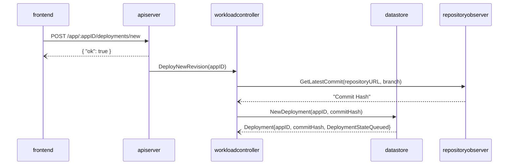

# Architecture

```mermaid
sequenceDiagram
	participant frontend
	participant apiserver
	participant workloadcontroller
	participant datastore
	participant repositoryobserver

	frontend->>apiserver: POST /app/:appID/deployments/new
	apiserver--)frontend: { "ok": true }

	apiserver->>workloadcontroller: DeployNewRevision(appID)
	workloadcontroller->>repositoryobserver: GetLatestCommit(repositoryURL, branch)
	repositoryobserver--)workloadcontroller: "Commit Hash"
	workloadcontroller->>datastore: NewDeployment(appID, commitHash)
	datastore--)workloadcontroller: Deployment{appID, commitHash, DeploymentStateQueued}
```
