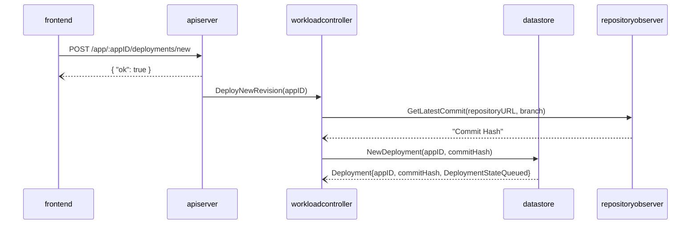
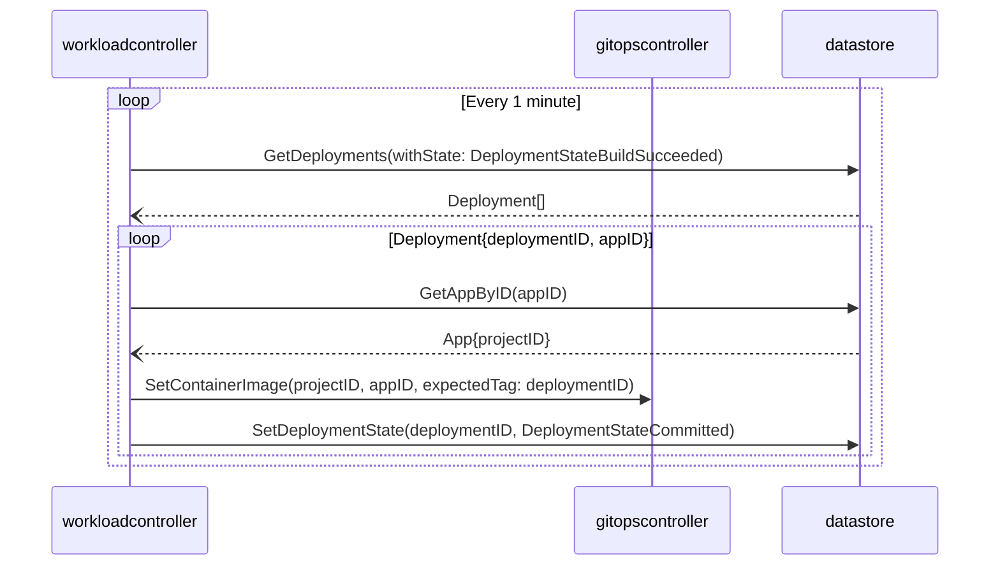

# Architecture

```mermaid
sequenceDiagram
	participant frontend
	participant apiserver
	participant workloadcontroller
	participant datastore
	participant repositoryobserver

	frontend->>apiserver: POST /app/:appID/deployments/new
	apiserver--)frontend: { "ok": true }

	apiserver->>workloadcontroller: DeployNewRevision(appID)
	workloadcontroller->>repositoryobserver: GetLatestCommit(repositoryURL, branch)
	repositoryobserver--)workloadcontroller: "Commit Hash"
	workloadcontroller->>datastore: NewDeployment(appID, commitHash)
	datastore--)workloadcontroller: Deployment{appID, commitHash, DeploymentStateQueued}
```

### Transitioning from `BuildSucceeded` to `Committed`

```mermaid
sequenceDiagram
	participant workloadcontroller
	participant gitopscontroller
	participant datastore

	loop Every 1 minute
		workloadcontroller->>datastore: GetDeployments(withState: DeploymentStateBuildSucceeded)
		datastore--)workloadcontroller: Deployment[]
		loop Deployment{deploymentID, appID}
			workloadcontroller->>datastore: GetAppByID(appID)
			datastore--)workloadcontroller: App{projectID}
			workloadcontroller->>gitopscontroller: SetContainerImage(projectID, appID, expectedTag: deploymentID)
			workloadcontroller->>datastore: SetDeploymentState(deploymentID, DeploymentStateCommitted)
		end
	end
```
